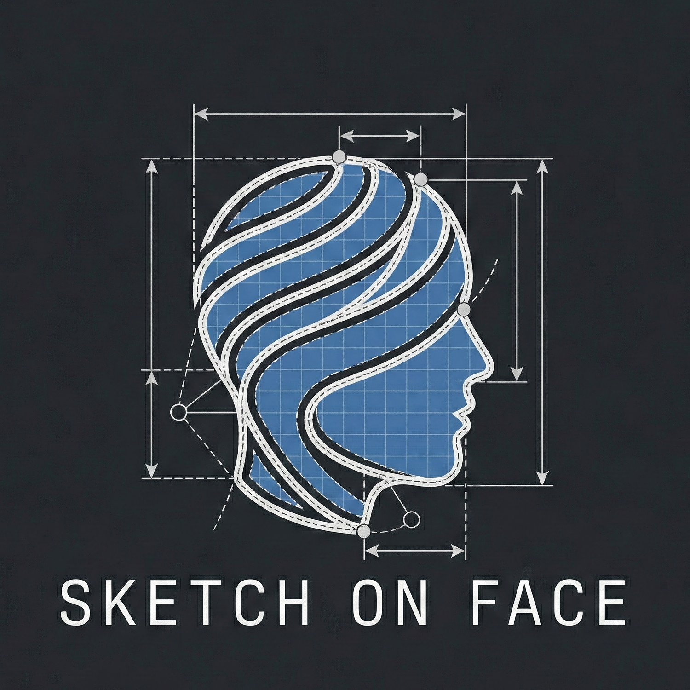

<div align="center">
  
</div>

# SketchOnFace

A Fusion 360 add-in that wraps 2D sketch curves onto arbitrary 3D surfaces using arc-length parameterization.

## Features

- **Works with any surface** - Not limited to cylinders. Supports ovals, ellipses, cones, and freeform surfaces.
- **Multi-face wrapping** - Wrap patterns continuously across multiple connected faces (e.g., around all sides of a rounded rectangle).
- **Arc-length parameterization** - Preserves proportions when wrapping onto non-uniform curves like ovals.
- **Auto-detect or manual edge selection** - Automatically finds the longest edge for wrap direction, or select one manually.
- **Scale and offset controls** - Adjust X/Y scale and surface offset distance.
- **Parametric editing** - Edit wrapped features through the timeline like native Fusion features.

## Installation

### Method 1: Copy to Add-Ins Folder (Recommended)

1. **Download the add-in**
   - Click the green **Code** button on this repository
   - Select **Download ZIP**
   - Extract the ZIP file

2. **Copy to Fusion 360 Add-Ins folder**

   **Windows:**
   ```
   %appdata%\Autodesk\Autodesk Fusion 360\API\AddIns
   ```
   (Paste this path into File Explorer's address bar)

   **Mac:**
   ```
   ~/Library/Application Support/Autodesk/Autodesk Fusion 360/API/AddIns
   ```
   (In Finder, press `Cmd+Shift+G` and paste the path)

   **Mac (App Store version):**
   ```
   ~/Library/Containers/com.autodesk.mas.fusion360/Data/Library/Application Support/Autodesk/Autodesk Fusion 360/API/AddIns
   ```

3. **Run the add-in**
   - Open Fusion 360
   - Press `Shift + S` (or go to **UTILITIES** tab → **ADD-INS** panel → **Scripts and Add-Ins**)
   - Click the **Add-Ins** tab at the top
   - Select **SketchOnFace** from the list
   - Click **Run**
   - The **Sketch On Face** button will appear in the **Add-Ins** panel

4. **Run on Startup (Optional)**
   - Check the **Run on Startup** checkbox to automatically load the add-in when Fusion 360 starts

### Method 2: Git Clone (For Development)

**Windows:**
```bash
cd %appdata%\Autodesk\Autodesk Fusion 360\API\AddIns
git clone https://github.com/yourusername/SketchOnFace.git
```

**Mac:**
```bash
cd ~/Library/Application\ Support/Autodesk/Autodesk\ Fusion\ 360/API/AddIns
git clone https://github.com/yourusername/SketchOnFace.git
```

Then follow steps 3-4 from Method 1.

### Troubleshooting Installation

- **Add-in doesn't appear**: Make sure the folder is named `SketchOnFace` (remove `-main` or `-master` suffix if present)
- **Errors on startup**: Check the **Text Commands** window (`View` → `Show Text Commands`) for error messages
- **Button doesn't appear**: Try restarting Fusion 360 after installation

## Usage

### Single Face Wrapping
1. Create a 2D sketch with your curves on any plane
2. Create or select a 3D body with the target surface
3. Run the **Sketch On Face** command from the Add-Ins panel
4. Select the target face
5. Select the sketch curves to wrap
6. (Optional) Select a reference edge to control wrap direction
7. Adjust scale and offset as needed
8. Click OK

### Multi-Face Wrapping
1. Create a 2D sketch with your pattern (e.g., repeating bars or text)
2. Create a body with multiple connected faces (e.g., rounded rectangle extrusion)
3. Run the **Sketch On Face** command
4. Select **multiple connected faces** (e.g., all 4 vertical sides)
5. Select the sketch curves to wrap
6. The pattern will wrap continuously across all selected faces
7. Click OK

**Note:** For multi-face wrapping, selected faces must:
- Share edges with at least one other selected face (must be connected)
- Form a simple chain or closed loop (no T-junctions or branches)

## How It Works

Unlike simple projection which distorts geometry on non-cylindrical surfaces, SketchOnFace uses **arc-length parameterization**:

1. **Surface Analysis** - Extracts parametric bounds and identifies the reference edge
2. **Arc-Length Mapping** - Uses `CurveEvaluator.getParameterAtLength()` to map X coordinates to positions along the surface perimeter, preserving distances
3. **UV Mapping** - Converts 2D sketch coordinates to surface UV parameters
4. **3D Point Generation** - Samples points on the surface and creates fitted splines

This approach ensures that a horizontal line wraps evenly around an oval, with equal arc length on all sides.

## Supported Geometry

| Sketch Type | Support |
|-------------|---------|
| Fitted Splines | Full |
| Lines | Full |
| Arcs | Full |
| Circles | Full |
| Fixed Splines | Full |
| Points | Full |

## Limitations

- **Face connectivity** - For multi-face wrapping, faces must form a simple chain or loop (no branches or T-junctions).
- **Orientation** - May need to experiment with reference edge selection for correct wrap direction.
- **Non-developable surfaces** - Some distortion is expected on doubly-curved surfaces (spheres, etc.)

## Development

### Setup

This project uses [uv](https://github.com/astral-sh/uv) for dependency management and a Makefile for common tasks.

```bash
# Install dependencies
make install

# Run tests
make test

# Run linter
make lint

# Format code
make format

# Run all checks (lint + test)
make check

# Show all available commands
make help
```

## Acknowledgments

Inspired by [Fusion360WrapSketch](https://github.com/hanskellner/Fusion360WrapSketch) by Hans Kellner, which wraps sketches onto cylinders. SketchOnFace extends this concept to arbitrary surfaces using parametric surface mapping.

## License

MIT License - See LICENSE file for details.
